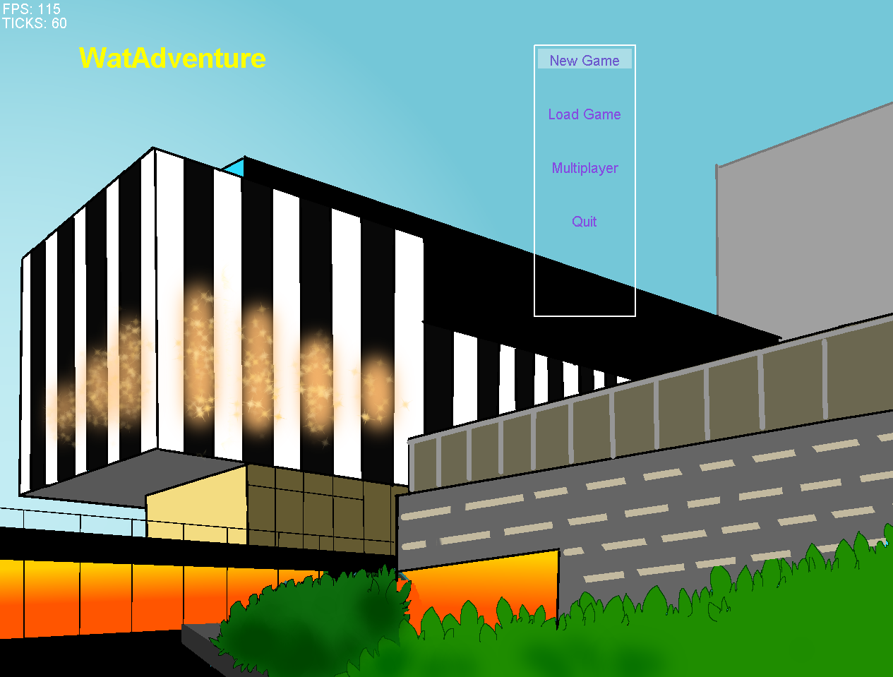
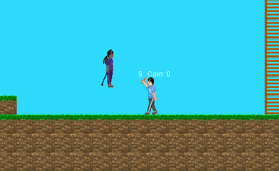
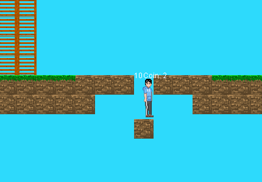
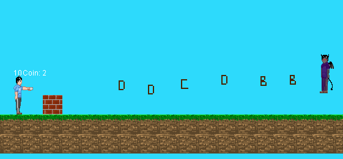
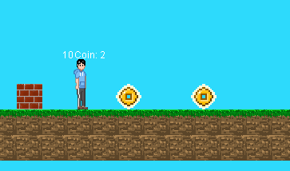
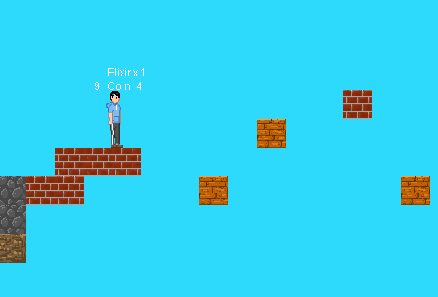
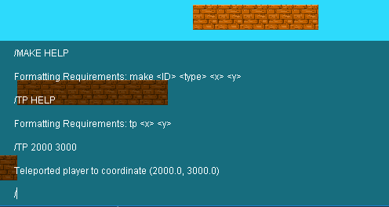
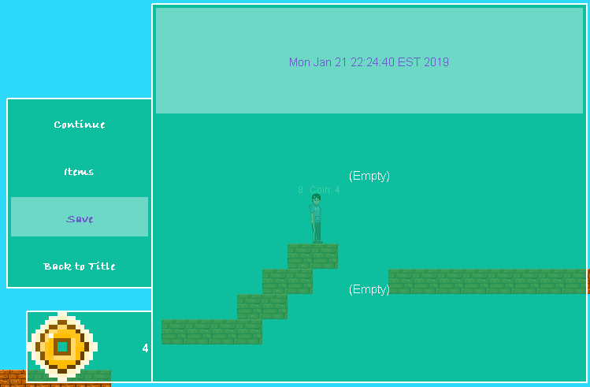
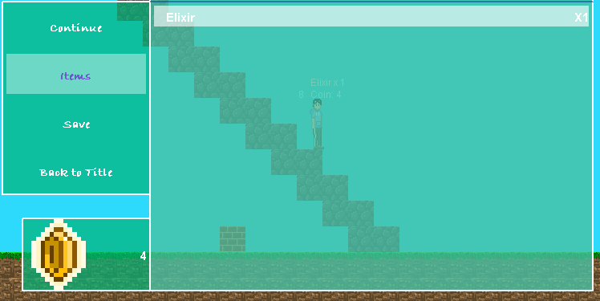
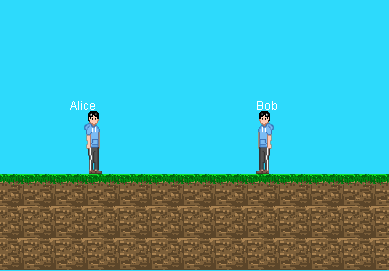

WatAdventure
======

Run `MainCanvas.java` to start
## Gallery

## Version
2.1.0
## Description
A desktop platformer game, built entirely in Java and free of all game engines!

Existing features:
* Save/Load
* Combat System
* Enemy AI
* Consumable Items
* Currency
* CLI for cheaters ;)
* **Multiplayer**
## What's new
Latest development adds multiplayer feature!

The integrated local server uses `Socket` to establish communication between client and server, and implements 
a custom TCP/IP protocol for data transmission. Before you host a local game, make sure to get `Server.java` 
running first.
